# SIT323/SIT737 Task 6.1: Kubernetes Cluster Deployment of a Containerized Node.js Application

### Student Name: Inwang Ubong Marshal
### Student ID: 222093271
### Repository: https://github.com/222093271/sit323-sit737-2025-prac6p.git

## Overview

The objective of this task is to design and deploy a simple containerized Node.js web application onto a Kubernetes cluster. Kubernetes, often referred to as "K8s," is an open-source platform that automates the deployment, scaling, and operation of application containers. In this task, we leverage Kubernetes as a container orchestration platform to run Node.js application efficiently and reliably.

To begin with, we utilise an existing Node.js application developed in a previous task (Task 5.1P), which serves static files using Express.js. This application is then containerized using Docker and built into a Docker image named my-themed-web-app. We ensure that the container is healthy and ready to serve traffic by integrating health checks in the docker-compose.yml configuration. After testing the container locally, we proceed to set up a local Kubernetes cluster using Docker Desktop, enabling Kubernetes functionality for development purposes.

Subsequently, we write Kubernetes deployment and service configuration files (deployment.yaml and service.yaml) to define how the containerized application should be deployed and accessed. Finally, we push all project files, including source code, Dockerfiles, Kubernetes YAML files, and documentation, to a GitHub repository for evaluation.

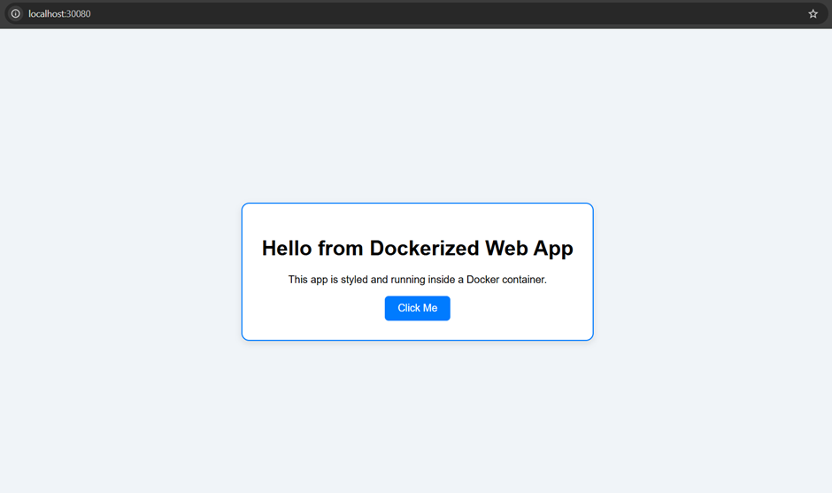


## Project Setup & Prerequisites

Before beginning the Kubernetes deployment, it was essential to ensure that local development environment was fully prepared with all the required tools. Since this task builds upon the work completed in Task 5.1P, we already had the foundational elements in place, such as the `application.js`, a working `Dockerfile`, and the basic folder structure for the Node.js application. The following tools were used to complete this task, each playing a vital role in the deployment process.


### Visual Studio Code (VS Code)

We opened the project directory (sit323-sit737-2025-prac6p) in VS Code and used the integrated terminal to execute all Git, Docker, and Kubernetes commands.


### 🐳 Docker

Docker is a platform that allows developers to package applications into containers — lightweight, standalone, and executable units that include everything needed to run a piece of software. In Task 5.1P, we already built a Docker image for the Node.js application using the provided `Dockerfile`. This image was named `my-themed-web-app`.
Docker was also used to run and test the application locally before deploying it to Kubernetes. This allowed us to ensure that the application was functioning correctly inside a container environment.
We used `Docker Desktop`, which also provides a graphical interface to manage containers and settings. Importantly, Docker Desktop includes a built-in Kubernetes engine, which we enabled to simulate a local Kubernetes cluster.


### ☸️ Kubernetes

Kubernetes is a container orchestration platform that automates the deployment, scaling, and management of containerized applications. Instead of manually running and managing individual containers (as we would with Docker alone), Kubernetes allows us to define the desired state of the application and then manages it automatically — handling container creation, networking, load balancing, and fault recovery.

In this project, Kubernetes was used to:
*	Run multiple instances (pods) of the Node.js container.
*	Automatically restart failed containers.
*	Expose the application to external traffic using a Kubernetes Service.

We deployed the application using two main Kubernetes resources:
*	A Deployment, which describes how many container replicas should run and how to manage them.
*	A Service, which exposes the deployment to allow users to access the app from a browser.

### 🔧 kubectl – The Kubernetes CLI

`kubectl` is the command-line interface for interacting with Kubernetes clusters. It is used to apply configuration files, inspect running services, view logs, and manage the entire Kubernetes environment from the terminal.

We used kubectl to:
*	Apply the Kubernetes deployment and service configuration files (`deployment.yaml` and `service.yaml`)
*	Check the status of pods and services (`kubectl get pods`, `kubectl get services`)
*	Debug or troubleshoot issues during deployment

When Docker Desktop is installed and Kubernetes is enabled, kubectl is automatically made available in your system’s PATH, so no separate installation is needed.

### Project Structure Recap (Up to Task 5.1P)
At this stage, the project folder contained the following:
 
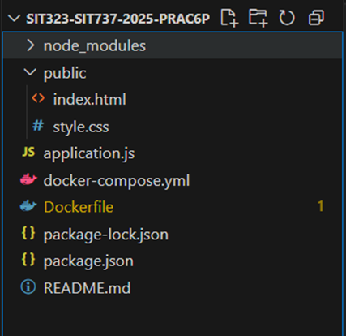

*	application.js: Node.js Express server serving static files from the /public directory.
*	Dockerfile: Defines how the app is built into a Docker image (my-themed-web-app).
*	docker-compose.yml: Defines service configuration and health checks (optional for this task).
*	public/index.html: A simple HTML page served by the app.
*	package.json: Holds metadata and dependencies for the Node.js app.

This formed the base of the project, and we built upon it by integrating Kubernetes in the next stages.


## Verifying Environment Setup

To ensure that the system is ready for the task, we verified the installation of all essential tools via the terminal. These tools include:

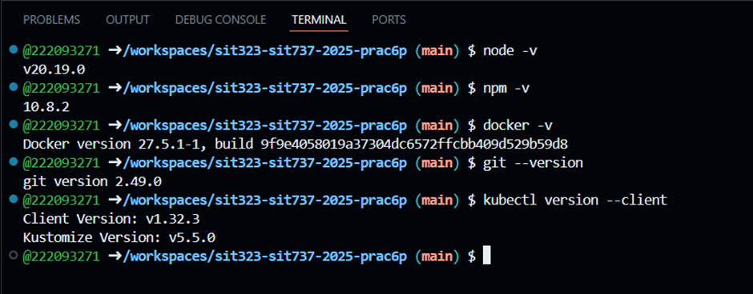

This screenshot confirms that all essential tools are correctly installed, including Node.js, npm, Docker, Git, and kubectl. These versions validate a fully functional development environment required for building, containerizing, and deploying the application to Kubernetes.


## 🐳 Building and Testing the Docker Image Locally

Before deploying the application to a Kubernetes cluster, it is essential to ensure that the application works correctly inside a Docker container. This acts as a sanity check — verifying that the Dockerfile builds properly, dependencies install correctly, and the application serves content as expected.

We already had the Dockerfile written during Task 5.1P, which looks like this:
```
FROM node:18

WORKDIR /app

COPY package*.json ./
RUN npm install

COPY . .

EXPOSE 3000

CMD ["node", "application.js"]
```

This file defines how the Docker image is built:
*	FROM node:18: Uses an official Node.js 18 base image.
*	WORKDIR /app: Sets the working directory inside the container.
*	COPY package*.json ./ and RUN npm install: Installs the Node.js dependencies.
*	COPY . .: Copies the rest of the project files.
*	EXPOSE 3000: Opens port 3000, which the app uses.
*	CMD: Tells Docker how to run the app.

### 🔨 Docker Build Command
To create the image, we used the following command in the terminal:
```
docker build -t my-themed-web-app .
```
This command tells Docker to:
*	Build the image in the current directory (.)
*	Tag the resulting image as my-themed-web-app

The output confirms that Docker successfully:
*	Downloaded the base image
*	Installed the dependencies (npm install)
*	Copied the necessary files
*	Created and named the image

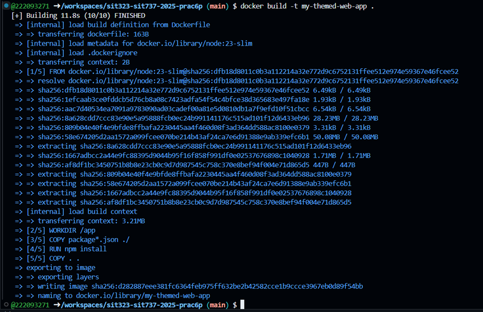

This screenshot shows that the image my-themed-web-app was built successfully, confirming that the Dockerfile is valid and the application dependencies are correctly installed.

### ✅ Verifying Docker Image Locally
Although not shown in the screenshot, we also tested the image using the following command to confirm that the application runs as expected:

```
docker run -p 3000:3000 my-themed-web-app
```

This maps container port 3000 to host port 3000, allowing us to view the app at: 👉 http://localhost:3000 

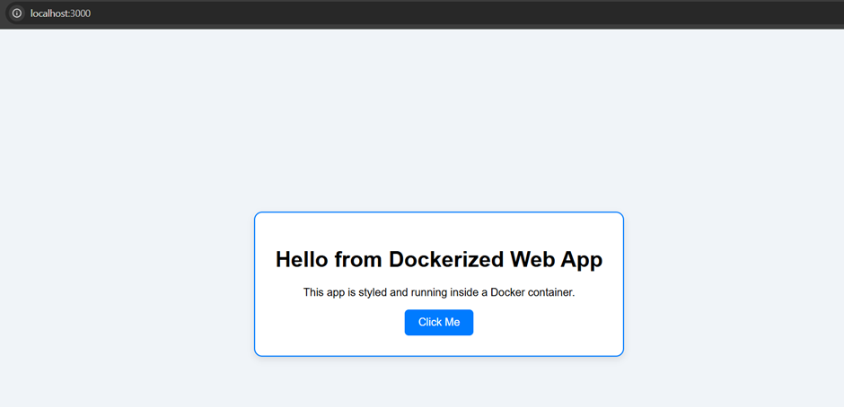

At this point, the app is displaying the contents of the `public/index.html` file with the `public/style.css` file through the Express static file server.
This step is crucial because if the image doesn't work locally, it will most certainly fail inside Kubernetes. It was verified, now ready to proceed to the Kubernetes deployment phase.


## ☸️ Creating Kubernetes Deployment and Service Configuration Files

Once we confirmed the Docker image was working as expected, we proceeded to deploy it inside a Kubernetes cluster. Kubernetes allows us to automate the management of containers by defining Deployment and Service objects using YAML configuration files. These files tell Kubernetes how to manage the application and how users can access it.

### Enabling Kubernetes in Docker Desktop

We used Docker Desktop as the Kubernetes engine, which supports a single-node local cluster. To enable Kubernetes, we navigated to Docker Desktop settings and toggled the “Enable Kubernetes” option.
This created a **kubeadm single-node cluster** named `docker-desktop`, which runs locally and is fully capable of simulating a production-grade Kubernetes environment for testing and development.

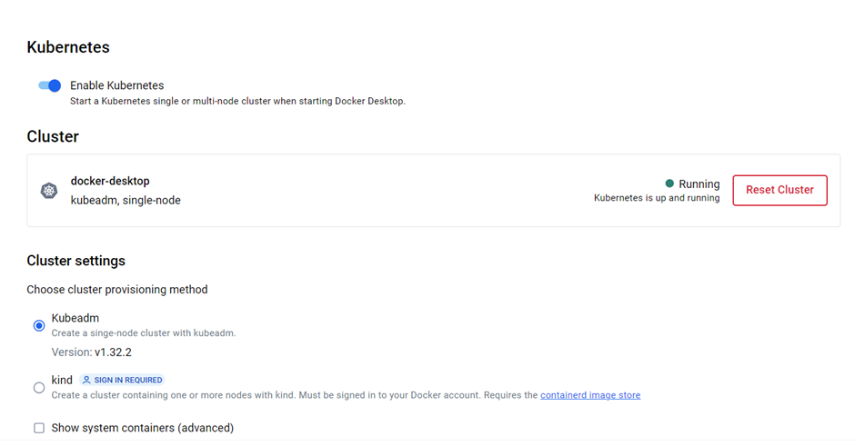

This confirms that the local Kubernetes environment is up and running successfully.

### 📁 Creating Deployment Configuration – `deployment.yaml`
The `deployment.yaml` file is used to instruct Kubernetes how to deploy the application, how many replicas (instances) we want, and what image to use.

Here’s the file structure:

```
apiVersion: apps/v1
kind: Deployment
metadata:
  name: themed-web-deployment
spec:
  replicas: 2
  selector:
    matchLabels:
      app: themed-web
  template:
    metadata:
      labels:
        app: themed-web
    spec:
      containers:
      - name: themed-web
        image: my-themed-web-app:latest
        imagePullPolicy: Never
        ports:
        - containerPort: 3000
```

**Key Concepts**:
* `replicas: 2`: Runs two instances of the app for load balancing and fault tolerance.
* `image: my-themed-web-app:latest`: Uses the local image built earlier.
* `imagePullPolicy: Never`: Ensures Kubernetes uses the local Docker image instead of trying to pull from Docker Hub.
* `selector` and `labels`: Used to associate the deployment with the corresponding service.

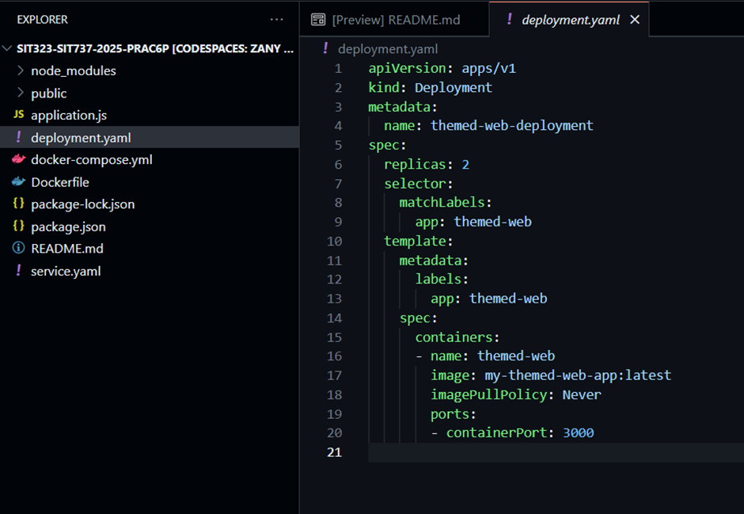


### 🌐 Creating Service Configuration – `service.yaml`
While deployments manage the lifecycle of containers, services expose them to external users. We created a `service.yaml` file to define how users can access the app through a browser.

Here’s the file:

```
apiVersion: v1
kind: Service
metadata:
  name: themed-web-service
spec:
  type: NodePort
  selector:
    app: themed-web
  ports:
    - protocol: TCP
      port: 3000
      targetPort: 3000
      nodePort: 30080
```

**Key Concepts**:
* `type: NodePort`: Opens a port on the host (your machine) and forwards traffic to the app.
* `port` and `targetPort`: Handle internal routing of requests.
* `nodePort: 30080`: Exposes the app to `localhost:30080`, making it accessible via a browser.

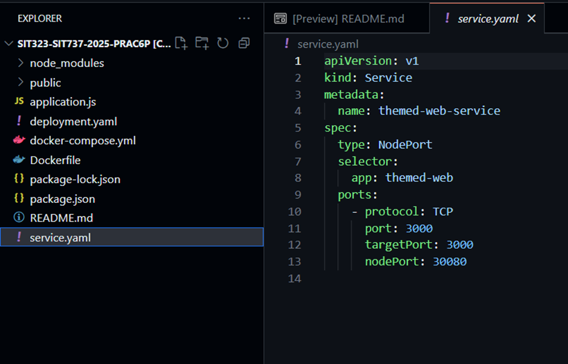


### 🩺 Reference to Previous Health Check with Docker Compose
While not required in Kubernetes for this task, we previously used a `docker-compose.yml` file to define a health check. This checks if the application is running correctly on http://localhost:3000 using `curl`. The same principles could be applied using Kubernetes readiness and liveness probes in advanced scenarios.

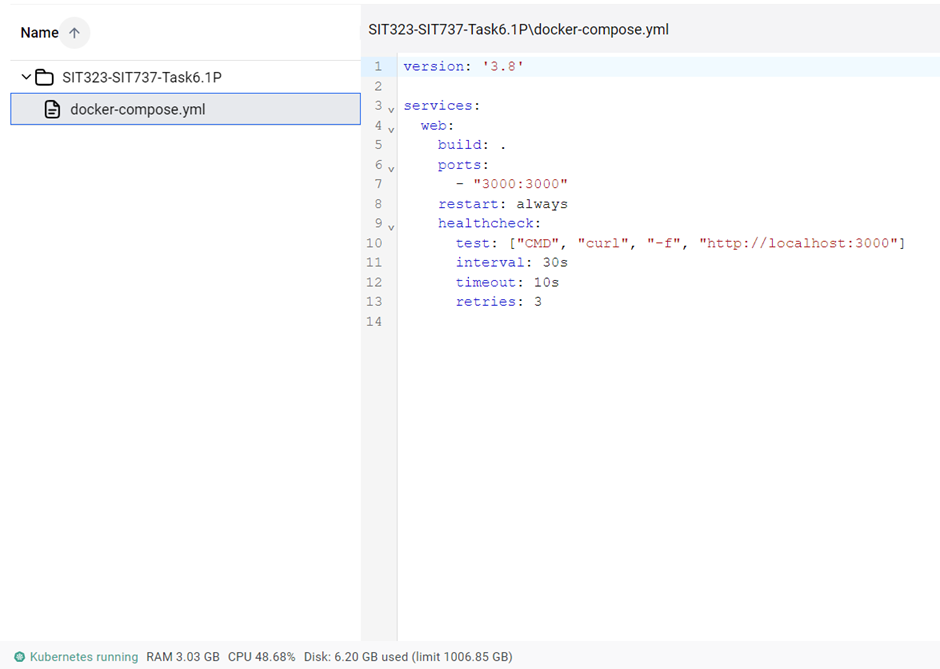


### ✅ Application Output Confirmation

To ensure everything worked correctly, we ran the container and verified that the application was serving content by looking at the logs and Docker UI.

* The console output displayed: App running at http://localhost:3000 — confirming that the app started successfully inside the container.

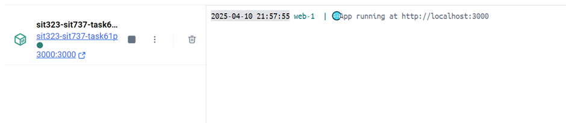

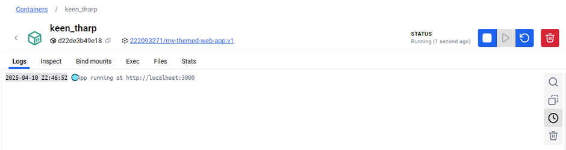

These outputs helped verify:
* The application is healthy.
* It is serving requests properly.
* No internal server or build errors occurred.

With these YAML files created and validated, we were now ready to apply them using kubectl, which we’ll cover in the next section.


## 🚀 Deploying to Kubernetes and Accessing the Application

After preparing the Kubernetes configuration files (`deployment.yaml` and `service.yaml`), we moved on to deploying the application into the Kubernetes cluster. This phase involved applying the configuration using kubectl, verifying that the pods and services were running, and finally testing the application in the browser.

### 🔄 Applying Kubernetes Configurations
Using the kubectl command-line tool, we executed the following commands in the terminal to apply the deployment and service definitions:

```
kubectl apply -f deployment.yaml
kubectl apply -f service.yaml
```

These commands instructed Kubernetes to:
*	Start two pod replicas of the Node.js application, as defined in the deployment.
*	Expose the application on NodePort 30080, making it accessible via http://localhost:30080. 


### Verifying Running Pods
To check if the application pods were successfully created and running, we used:
```
kubectl get pods
```
This command lists all active pods in the current namespace.

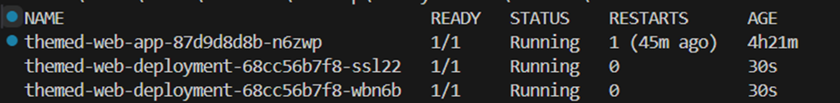

This confirms that Kubernetes has successfully created two replicas of the application, both marked as Running, indicating that the containerized app is functioning as expected within the cluster.


### 🌐 Verifying Kubernetes Service

Next, we verified that the application was exposed properly by running:
```
kubectl get services
```
This command lists all the Kubernetes services and their ports.

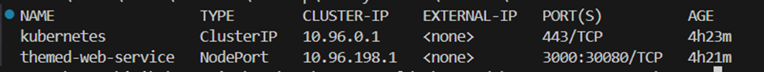

The NodePort configuration exposes internal port `3000` to external port `30080`, allowing us to access the app from the browser via http://localhost:30080.


### ✅ Accessing the Application in Browser

After successful deployment and confirmation of pod and service status, we opened a browser and visited: http://localhost:30080 


This final confirmation proves that the entire deployment workflow — from Docker build to Kubernetes deployment and service exposure — was executed successfully, and the application is accessible externally as expected.


## 🔒 Improving Docker Image Security: Vulnerability Scanning & Base Image Optimisation

Security is a critical aspect of containerized applications, especially when deploying them to cloud-native environments like Kubernetes. As part of this task, we evaluated the security of the Docker image using Docker Scout, which scans image layers for known vulnerabilities.


### Initial Image Scan (Using node:18)

Originally, the Dockerfile was based on the node:18 image:
```
FROM node:18
```

While functional, a scan via Docker Scout revealed 4 high-severity vulnerabilities. High vulnerabilities can pose serious risks, especially when containers are deployed in production or exposed to the internet.

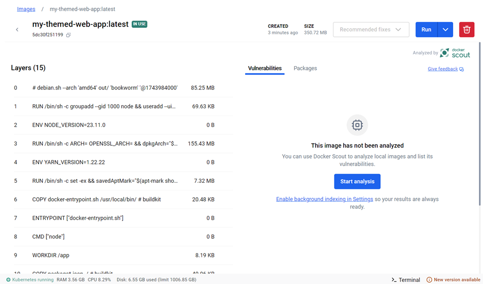

This image had several vulnerable packages coming from the base OS layer (Debian-based) that node:18 depends on.


### Fixing Vulnerabilities by Updating the Base Image

To resolve this, we switched to a more lightweight and secure version:
```
FROM node:23-slim
```

This change uses a slimmer, more secure variant of Node.js version 23, which contains fewer pre-installed packages and therefore reduces the attack surface.

After rebuilding the image and scanning it again using Docker Scout, the results showed:
*	All high-severity vulnerabilities were resolved
*	Only low-severity CVEs remained, mostly from base Debian packages
*	These are not critical and generally acceptable in development/testing environments

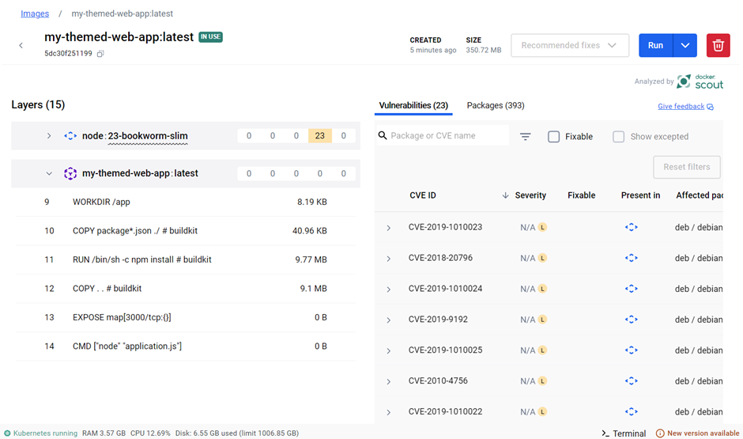

This step significantly improved the security of the Docker image with minimal effort, and it's a great example of proactive DevSecOps.


### 🧱 Image Layer Analysis

Docker Scout also provided detailed insights into each image layer. As seen in the breakdown:
*	The Node version, npm install, and package copying layers were correctly recognised.
*	No additional unexpected packages or bloated files were introduced during the build.
*	The resulting image size remained efficient (~350MB), and ready for deployment.

By simply switching to a more modern and minimal base image (node:23-slim), we improved the image security and reliability without sacrificing performance or functionality.


## Pushing the Project to GitHub & Final Submission Instructions

To submit the task, all project files — including source code, `Dockerfile`, `docker-compose.yml`, Kubernetes YAMLs, and documentation — were pushed to a GitHub repository.

**Git Commands Used**:
```
git init
git add .
git commit -m "Initial commit for SIT737 Kubernetes deployment"
git remote add origin https://github.com/222093271/sit323-sit737-2025-prac6p.git 
git pull origin main --allow-unrelated-histories   # if repo already had files
git push -u origin main
```


## Conclusion & Learning 

Completing this task provided a hands-on, end-to-end experience in deploying a containerized web application using Kubernetes — a vital skill in modern cloud-native software development. The process began with a foundational Node.js application, which was containerized using Docker, tested locally, and eventually deployed to a Kubernetes cluster for orchestration and scalability.

Enabling Kubernetes through Docker Desktop introduced us to single-node cluster management and highlighted the power of using YAML to declaratively define application infrastructure. Writing `deployment.yaml` and `service.yaml` deepened the understanding of Kubernetes objects such as pods, deployments, and NodePort services.

Security was also emphasised by scanning the Docker image with Docker Scout. By replacing a vulnerable base image (`node:18`) with a more secure one (`node:23-slim`), we learned how small decisions can significantly impact the safety and reliability of applications.

Finally, pushing the project to GitHub reinforced version control, collaboration, and transparency — all crucial aspects in professional DevOps workflows.

This project not only cemented the technical skills in containerization and orchestration but also emphasised the importance of automation, configuration, and security in deploying scalable cloud-native applications.


